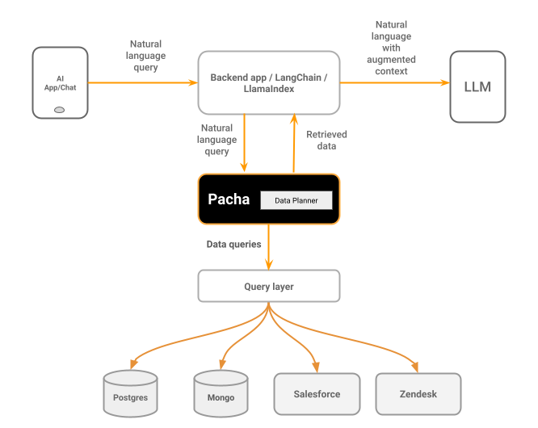

# pacha-ai

Connect your private data to LLMs, Agentic RAG

## What is it?

Pacha is an AI agent built over a custom Python-language model that does complex planning and retrieval of context over private data.

You would use Pacha with your favourite LLMs to generate grounded responses in your AI apps/agents.


## Quickstart

#### Requirements

- An LLM for response generation
- A unified query execution layer like Hasura


```python

from pacha import pacha 
from openai import OpenAI

llm = OpenAI(model="gpt-4o")

pachaClient = pacha(llm=llm, query_layer='https://myhasuraproject.com/sql')

response = pachaClient.chat("Write a personalized email to the customer with the most amount of spend and list out some of the movies they have rented in the email ")

```

## Reference Architecture



## Integrations

- LangChain
- LlamaIndex

## Examples
